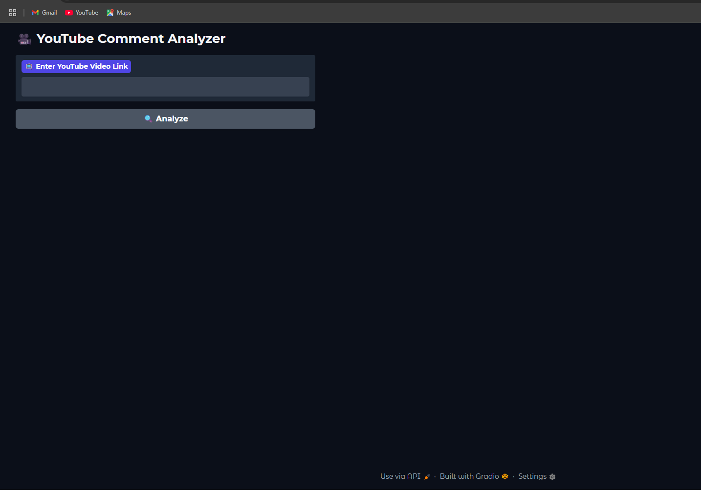
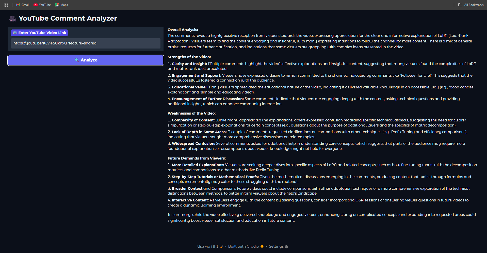

#  CommentSense: AI-Powered YouTube Comment Analyzer for Creators 🎥

**CommentSense** is an intelligent tool that leverages OpenAI’s Large Language Models (LLMs) to **analyze YouTube comments** and generate high-level feedback for content creators. Just paste a YouTube link, and CommentSense will summarize what your audience thinks — the good, the bad, and what they want next.

>  Designed for creators, brand strategists, and YouTube growth hackers.



---

##  Features

- Input any **YouTube video link**
- Automatically fetches **comments** using the **YouTube Data API**
- Uses **OpenAI GPT** to analyze:
  - ✅ Overall audience sentiment
  - ✅ Strengths of the video
  - ✅ Weaknesses or pain points
  - ✅ Suggestions or requests from viewers
-  Outputs clean, structured insights
-  Visualized with **Gradio UI**

---

## Use Cases

- **Content Creators** – Understand viewer feedback and plan better content
- **Marketing Teams** – Gauge brand reception and viewer language
- **Researchers** – Track sentiment trends and audience behavior
- **Developers** – Build custom tools around YouTube engagement

---

##  How It Works

1. User enters a YouTube video URL  
2. Tool extracts the video ID  
3. Fetches up to 100 top-level comments using the **YouTube Data API v3**  
4. Sends comment list to **OpenAI GPT-4** with the following prompt:

```python
system_message = "You are an assistant that analyses YouTube comments"
user_prompt = f"""Analyse the following comments and tell the channel owner:
1. Overall audience sentiment
2. Strengths of the video
3. Weaknesses
4. Future content demands or suggestions from viewers.

Comments: {comments_list}
```
5. Returns a structured analysis for the creator to act on.



---

## 🛠️ Installation

```bash
git clone https://github.com/johnIT56/CommentSense.git
cd CommentSense
pip install -r requirements.txt
python app.py

```
 You’ll need a YouTube Data API key and an OpenAI API key set up in your environment or a config file.

---

Contributing
Contributions are welcome! Please open issues or pull requests to improve functionality, UI, or model prompts.

---

License
MIT License

---

Contact
Built with 💡 by johnIT56
